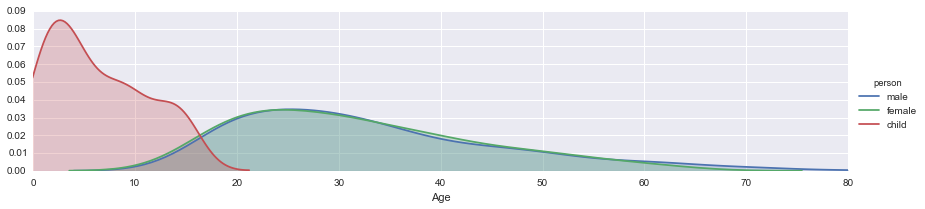

# Kaggle Titanic Challenge 
 Data is downloaded from https://www.kaggle.com/c/titanic-gettingStarted
 I have used train.csv file from the above link.
 

    import pandas as pd
    from pandas import Series,DataFrame
    
    titanic_df = pd.read_csv('train.csv')
    
    titanic_df.head()

<table border="1" class="dataframe">
  <thead>
    <tr style="text-align: right;">
      <th></th>
      <th>PassengerId</th>
      <th>Survived</th>
      <th>Pclass</th>
      <th>Name</th>
      <th>Sex</th>
      <th>Age</th>
      <th>SibSp</th>
      <th>Parch</th>
      <th>Ticket</th>
      <th>Fare</th>
      <th>Cabin</th>
      <th>Embarked</th>
    </tr>
  </thead>
  <tbody>
    <tr>
      <th>0</th>
      <td>1</td>
      <td>0</td>
      <td>3</td>
      <td>Braund, Mr. Owen Harris</td>
      <td>male</td>
      <td>22</td>
      <td>1</td>
      <td>0</td>
      <td>A/5 21171</td>
      <td>7.2500</td>
      <td>NaN</td>
      <td>S</td>
    </tr>
    <tr>
      <th>1</th>
      <td>2</td>
      <td>1</td>
      <td>1</td>
      <td>Cumings, Mrs. John Bradley (Florence Briggs Th...</td>
      <td>female</td>
      <td>38</td>
      <td>1</td>
      <td>0</td>
      <td>PC 17599</td>
      <td>71.2833</td>
      <td>C85</td>
      <td>C</td>
    </tr>
    <tr>
      <th>2</th>
      <td>3</td>
      <td>1</td>
      <td>3</td>
      <td>Heikkinen, Miss. Laina</td>
      <td>female</td>
      <td>26</td>
      <td>0</td>
      <td>0</td>
      <td>STON/O2. 3101282</td>
      <td>7.9250</td>
      <td>NaN</td>
      <td>S</td>
    </tr>
    <tr>
      <th>3</th>
      <td>4</td>
      <td>1</td>
      <td>1</td>
      <td>Futrelle, Mrs. Jacques Heath (Lily May Peel)</td>
      <td>female</td>
      <td>35</td>
      <td>1</td>
      <td>0</td>
      <td>113803</td>
      <td>53.1000</td>
      <td>C123</td>
      <td>S</td>
    </tr>
    <tr>
      <th>4</th>
      <td>5</td>
      <td>0</td>
      <td>3</td>
      <td>Allen, Mr. William Henry</td>
      <td>male</td>
      <td>35</td>
      <td>0</td>
      <td>0</td>
      <td>373450</td>
      <td>8.0500</td>
      <td>NaN</td>
      <td>S</td>
    </tr>
  </tbody>
</table>

    #Now we will get the information about the train.csv dataset
    titanic_df.info()

    <class 'pandas.core.frame.DataFrame'>
    Int64Index: 891 entries, 0 to 890
    Data columns (total 12 columns):
    PassengerId    891 non-null int64
    Survived       891 non-null int64
    Pclass         891 non-null int64
    Name           891 non-null object
    Sex            891 non-null object
    Age            714 non-null float64
    SibSp          891 non-null int64
    Parch          891 non-null int64
    Ticket         891 non-null object
    Fare           891 non-null float64
    Cabin          204 non-null object
    Embarked       889 non-null object
    dtypes: float64(2), int64(5), object(5)
    memory usage: 90.5+ KB
    

Now we will try to answer few questions using data analysis. 
1. Who were the passengers on the Titanic? (Ages,Gender,Class,..etc)
2. What deck were the passengers on and how does that relate to their class?
3. Where did the passengers come from?
4. Who was alone and who was with family? 
5. What factors helped someone survive the sinking?

We will answer the first question now
1. Who were the passengers on the Titanic? (Ages,Gender,Class,..etc)

    import numpy as np
    import matplotlib.pyplot as plt
    import seaborn as sns
    %matplotlib inline
    

    #Let's check the gender data first
    sns.factorplot('Sex',data=titanic_df, kind = 'count')

    # Now let's seperate the genders by classes
    sns.factorplot('Pclass',data=titanic_df,hue='Sex', kind='count')

    <seaborn.axisgrid.FacetGrid at 0x18e4c358>

As we can see, there are a lot of males in the 3rd class than femals. Now let's slip between males, females and children.

    # We'll treat anyone as under 16 as a child.
    def male_female_child(passenger):
        # Take the Age and Sex
        age,sex = passenger
        # Compare the age, otherwise leave the sex
        if age < 16:
            return 'child'
        else:
            return sex
    
    titanic_df['person'] = titanic_df[['Age','Sex']].apply(male_female_child,axis=1)

    titanic_df[0:10]

<table border="1" class="dataframe">
  <thead>
    <tr style="text-align: right;">
      <th></th>
      <th>PassengerId</th>
      <th>Survived</th>
      <th>Pclass</th>
      <th>Name</th>
      <th>Sex</th>
      <th>Age</th>
      <th>SibSp</th>
      <th>Parch</th>
      <th>Ticket</th>
      <th>Fare</th>
      <th>Cabin</th>
      <th>Embarked</th>
      <th>person</th>
    </tr>
  </thead>
  <tbody>
    <tr>
      <th>0</th>
      <td>1</td>
      <td>0</td>
      <td>3</td>
      <td>Braund, Mr. Owen Harris</td>
      <td>male</td>
      <td>22</td>
      <td>1</td>
      <td>0</td>
      <td>A/5 21171</td>
      <td>7.2500</td>
      <td>NaN</td>
      <td>S</td>
      <td>male</td>
    </tr>
    <tr>
      <th>1</th>
      <td>2</td>
      <td>1</td>
      <td>1</td>
      <td>Cumings, Mrs. John Bradley (Florence Briggs Th...</td>
      <td>female</td>
      <td>38</td>
      <td>1</td>
      <td>0</td>
      <td>PC 17599</td>
      <td>71.2833</td>
      <td>C85</td>
      <td>C</td>
      <td>female</td>
    </tr>
    <tr>
      <th>2</th>
      <td>3</td>
      <td>1</td>
      <td>3</td>
      <td>Heikkinen, Miss. Laina</td>
      <td>female</td>
      <td>26</td>
      <td>0</td>
      <td>0</td>
      <td>STON/O2. 3101282</td>
      <td>7.9250</td>
      <td>NaN</td>
      <td>S</td>
      <td>female</td>
    </tr>
    <tr>
      <th>3</th>
      <td>4</td>
      <td>1</td>
      <td>1</td>
      <td>Futrelle, Mrs. Jacques Heath (Lily May Peel)</td>
      <td>female</td>
      <td>35</td>
      <td>1</td>
      <td>0</td>
      <td>113803</td>
      <td>53.1000</td>
      <td>C123</td>
      <td>S</td>
      <td>female</td>
    </tr>
    <tr>
      <th>4</th>
      <td>5</td>
      <td>0</td>
      <td>3</td>
      <td>Allen, Mr. William Henry</td>
      <td>male</td>
      <td>35</td>
      <td>0</td>
      <td>0</td>
      <td>373450</td>
      <td>8.0500</td>
      <td>NaN</td>
      <td>S</td>
      <td>male</td>
    </tr>
    <tr>
      <th>5</th>
      <td>6</td>
      <td>0</td>
      <td>3</td>
      <td>Moran, Mr. James</td>
      <td>male</td>
      <td>NaN</td>
      <td>0</td>
      <td>0</td>
      <td>330877</td>
      <td>8.4583</td>
      <td>NaN</td>
      <td>Q</td>
      <td>male</td>
    </tr>
    <tr>
      <th>6</th>
      <td>7</td>
      <td>0</td>
      <td>1</td>
      <td>McCarthy, Mr. Timothy J</td>
      <td>male</td>
      <td>54</td>
      <td>0</td>
      <td>0</td>
      <td>17463</td>
      <td>51.8625</td>
      <td>E46</td>
      <td>S</td>
      <td>male</td>
    </tr>
    <tr>
      <th>7</th>
      <td>8</td>
      <td>0</td>
      <td>3</td>
      <td>Palsson, Master. Gosta Leonard</td>
      <td>male</td>
      <td>2</td>
      <td>3</td>
      <td>1</td>
      <td>349909</td>
      <td>21.0750</td>
      <td>NaN</td>
      <td>S</td>
      <td>child</td>
    </tr>
    <tr>
      <th>8</th>
      <td>9</td>
      <td>1</td>
      <td>3</td>
      <td>Johnson, Mrs. Oscar W (Elisabeth Vilhelmina Berg)</td>
      <td>female</td>
      <td>27</td>
      <td>0</td>
      <td>2</td>
      <td>347742</td>
      <td>11.1333</td>
      <td>NaN</td>
      <td>S</td>
      <td>female</td>
    </tr>
    <tr>
      <th>9</th>
      <td>10</td>
      <td>1</td>
      <td>2</td>
      <td>Nasser, Mrs. Nicholas (Adele Achem)</td>
      <td>female</td>
      <td>14</td>
      <td>1</td>
      <td>0</td>
      <td>237736</td>
      <td>30.0708</td>
      <td>NaN</td>
      <td>C</td>
      <td>child</td>
    </tr>
  </tbody>
</table>

Now we have separted the passengers between male, female and child. Now we can check to see if "Women and children first policy" was there or not.

    sns.factorplot('Pclass',data=titanic_df,hue='person', kind = 'count')

    <seaborn.axisgrid.FacetGrid at 0x19877a58>

As one would expect that there would be more children in first class but to the contrary there are maximum children from third class. 

    titanic_df['Age'].hist(bins=70)
    

    <matplotlib.axes._subplots.AxesSubplot at 0x19984048>

    #comparison of male,female,child
    titanic_df['person'].value_counts()

    male      537
    female    271
    child      83
    dtype: int64

    fig = sns.FacetGrid(titanic_df, hue="Sex",aspect=4)
    fig.map(sns.kdeplot,'Age',shade= True)
    oldest = titanic_df['Age'].max()
    fig.set(xlim=(0,oldest))
    fig.add_legend()

    <seaborn.axisgrid.FacetGrid at 0x1b90d7b8>

    #Same thing for the 'person' column to include children:
    
    fig = sns.FacetGrid(titanic_df, hue="person",aspect=4)
    fig.map(sns.kdeplot,'Age',shade= True)
    oldest = titanic_df['Age'].max()
    fig.set(xlim=(0,oldest))
    fig.add_legend()

    <seaborn.axisgrid.FacetGrid at 0x1bb59160>

    # Let's do the same for class by changing the hue argument:
    fig = sns.FacetGrid(titanic_df, hue="Pclass",aspect=4)
    fig.map(sns.kdeplot,'Age',shade= True)
    oldest = titanic_df['Age'].max()
    fig.set(xlim=(0,oldest))
    fig.add_legend()

    <seaborn.axisgrid.FacetGrid at 0x1b90dd68>

Now Let's move on to the second question:
2. What deck were the passengers on and how does that relate to their class?

    titanic_df.head()

<table border="1" class="dataframe">
  <thead>
    <tr style="text-align: right;">
      <th></th>
      <th>PassengerId</th>
      <th>Survived</th>
      <th>Pclass</th>
      <th>Name</th>
      <th>Sex</th>
      <th>Age</th>
      <th>SibSp</th>
      <th>Parch</th>
      <th>Ticket</th>
      <th>Fare</th>
      <th>Cabin</th>
      <th>Embarked</th>
      <th>person</th>
    </tr>
  </thead>
  <tbody>
    <tr>
      <th>0</th>
      <td>1</td>
      <td>0</td>
      <td>3</td>
      <td>Braund, Mr. Owen Harris</td>
      <td>male</td>
      <td>22</td>
      <td>1</td>
      <td>0</td>
      <td>A/5 21171</td>
      <td>7.2500</td>
      <td>NaN</td>
      <td>S</td>
      <td>male</td>
    </tr>
    <tr>
      <th>1</th>
      <td>2</td>
      <td>1</td>
      <td>1</td>
      <td>Cumings, Mrs. John Bradley (Florence Briggs Th...</td>
      <td>female</td>
      <td>38</td>
      <td>1</td>
      <td>0</td>
      <td>PC 17599</td>
      <td>71.2833</td>
      <td>C85</td>
      <td>C</td>
      <td>female</td>
    </tr>
    <tr>
      <th>2</th>
      <td>3</td>
      <td>1</td>
      <td>3</td>
      <td>Heikkinen, Miss. Laina</td>
      <td>female</td>
      <td>26</td>
      <td>0</td>
      <td>0</td>
      <td>STON/O2. 3101282</td>
      <td>7.9250</td>
      <td>NaN</td>
      <td>S</td>
      <td>female</td>
    </tr>
    <tr>
      <th>3</th>
      <td>4</td>
      <td>1</td>
      <td>1</td>
      <td>Futrelle, Mrs. Jacques Heath (Lily May Peel)</td>
      <td>female</td>
      <td>35</td>
      <td>1</td>
      <td>0</td>
      <td>113803</td>
      <td>53.1000</td>
      <td>C123</td>
      <td>S</td>
      <td>female</td>
    </tr>
    <tr>
      <th>4</th>
      <td>5</td>
      <td>0</td>
      <td>3</td>
      <td>Allen, Mr. William Henry</td>
      <td>male</td>
      <td>35</td>
      <td>0</td>
      <td>0</td>
      <td>373450</td>
      <td>8.0500</td>
      <td>NaN</td>
      <td>S</td>
      <td>male</td>
    </tr>
  </tbody>
</table>

Let's drop the NaN values from cabin column.

    deck = titanic_df['Cabin'].dropna()

    deck.head()

    1      C85
    3     C123
    6      E46
    10      G6
    11    C103
    Name: Cabin, dtype: object

We only need to classify the first letter of the deck. (eg. A, B, C, D, E, F, G)

    levels = []
    for level in deck:
        levels.append(level[0]) 
    
    cabin_df = DataFrame(levels)
    cabin_df.columns = ['Cabin']
    sns.factorplot('Cabin',data=cabin_df,palette='winter_d', kind = 'count')

    <seaborn.axisgrid.FacetGrid at 0x1bf104a8>

Let's drop down 'T' deck value because it doesn't make any sense

    cabin_df = cabin_df[cabin_df.Cabin != 'T']
    sns.factorplot('Cabin',data=cabin_df,palette='summer', kind = 'count')

    <seaborn.axisgrid.FacetGrid at 0x1ee58860>

Awesome! Now let's move on to third question:
3. Where did the passengers come from?

    titanic_df.head()

<table border="1" class="dataframe">
  <thead>
    <tr style="text-align: right;">
      <th></th>
      <th>PassengerId</th>
      <th>Survived</th>
      <th>Pclass</th>
      <th>Name</th>
      <th>Sex</th>
      <th>Age</th>
      <th>SibSp</th>
      <th>Parch</th>
      <th>Ticket</th>
      <th>Fare</th>
      <th>Cabin</th>
      <th>Embarked</th>
      <th>person</th>
    </tr>
  </thead>
  <tbody>
    <tr>
      <th>0</th>
      <td>1</td>
      <td>0</td>
      <td>3</td>
      <td>Braund, Mr. Owen Harris</td>
      <td>male</td>
      <td>22</td>
      <td>1</td>
      <td>0</td>
      <td>A/5 21171</td>
      <td>7.2500</td>
      <td>NaN</td>
      <td>S</td>
      <td>male</td>
    </tr>
    <tr>
      <th>1</th>
      <td>2</td>
      <td>1</td>
      <td>1</td>
      <td>Cumings, Mrs. John Bradley (Florence Briggs Th...</td>
      <td>female</td>
      <td>38</td>
      <td>1</td>
      <td>0</td>
      <td>PC 17599</td>
      <td>71.2833</td>
      <td>C85</td>
      <td>C</td>
      <td>female</td>
    </tr>
    <tr>
      <th>2</th>
      <td>3</td>
      <td>1</td>
      <td>3</td>
      <td>Heikkinen, Miss. Laina</td>
      <td>female</td>
      <td>26</td>
      <td>0</td>
      <td>0</td>
      <td>STON/O2. 3101282</td>
      <td>7.9250</td>
      <td>NaN</td>
      <td>S</td>
      <td>female</td>
    </tr>
    <tr>
      <th>3</th>
      <td>4</td>
      <td>1</td>
      <td>1</td>
      <td>Futrelle, Mrs. Jacques Heath (Lily May Peel)</td>
      <td>female</td>
      <td>35</td>
      <td>1</td>
      <td>0</td>
      <td>113803</td>
      <td>53.1000</td>
      <td>C123</td>
      <td>S</td>
      <td>female</td>
    </tr>
    <tr>
      <th>4</th>
      <td>5</td>
      <td>0</td>
      <td>3</td>
      <td>Allen, Mr. William Henry</td>
      <td>male</td>
      <td>35</td>
      <td>0</td>
      <td>0</td>
      <td>373450</td>
      <td>8.0500</td>
      <td>NaN</td>
      <td>S</td>
      <td>male</td>
    </tr>
  </tbody>
</table>

Embarked column has C which stands for Cherbourg, Q which stands for Queenstown, and S which stands for Southamption. (Given in description on Kaggle)

    sns.factorplot('Embarked',data=titanic_df,hue='Pclass',x_order=['C','Q','S'], kind = 'count')

    <seaborn.axisgrid.FacetGrid at 0x1f00b898>

Almost all the passenegers that boarded from Queenstown were from 3rd class. It might be fascinating to see the economics of the town during that time period. 

Let's move onto the next question:
4. Who was alone and who was with family?

    titanic_df['Alone'] =  titanic_df.Parch + titanic_df.SibSp
    titanic_df['Alone']

    0       1
    1       1
    2       0
    3       1
    4       0
    5       0
    6       0
    7       4
    8       2
    9       1
    10      2
    11      0
    12      0
    13      6
    14      0
    15      0
    16      5
    17      0
    18      1
    19      0
    20      0
    21      0
    22      0
    23      0
    24      4
    25      6
    26      0
    27      5
    28      0
    29      0
           ..
    861     1
    862     0
    863    10
    864     0
    865     0
    866     1
    867     0
    868     0
    869     2
    870     0
    871     2
    872     0
    873     0
    874     1
    875     0
    876     0
    877     0
    878     0
    879     1
    880     1
    881     0
    882     0
    883     0
    884     0
    885     5
    886     0
    887     0
    888     3
    889     0
    890     0
    Name: Alone, dtype: int64

Now we know that if the Alone column is anything but 0, then the passenger had family aboard and wasn't alone. So let's change the column now so that if the value is greater than 0, we know the passenger was with his/her family, otherwise they were alone.

    titanic_df['Alone'].loc[titanic_df['Alone'] >0] = 'With Family'
    titanic_df['Alone'].loc[titanic_df['Alone'] == 0] = 'Alone'
    

    C:\Anaconda\lib\site-packages\pandas\core\indexing.py:115: SettingWithCopyWarning: 
    A value is trying to be set on a copy of a slice from a DataFrame
    
    See the the caveats in the documentation: http://pandas.pydata.org/pandas-docs/stable/indexing.html#indexing-view-versus-copy
      self._setitem_with_indexer(indexer, value)
    

    titanic_df.head()

<table border="1" class="dataframe">
  <thead>
    <tr style="text-align: right;">
      <th></th>
      <th>PassengerId</th>
      <th>Survived</th>
      <th>Pclass</th>
      <th>Name</th>
      <th>Sex</th>
      <th>Age</th>
      <th>SibSp</th>
      <th>Parch</th>
      <th>Ticket</th>
      <th>Fare</th>
      <th>Cabin</th>
      <th>Embarked</th>
      <th>person</th>
      <th>Alone</th>
    </tr>
  </thead>
  <tbody>
    <tr>
      <th>0</th>
      <td>1</td>
      <td>0</td>
      <td>3</td>
      <td>Braund, Mr. Owen Harris</td>
      <td>male</td>
      <td>22</td>
      <td>1</td>
      <td>0</td>
      <td>A/5 21171</td>
      <td>7.2500</td>
      <td>NaN</td>
      <td>S</td>
      <td>male</td>
      <td>With Family</td>
    </tr>
    <tr>
      <th>1</th>
      <td>2</td>
      <td>1</td>
      <td>1</td>
      <td>Cumings, Mrs. John Bradley (Florence Briggs Th...</td>
      <td>female</td>
      <td>38</td>
      <td>1</td>
      <td>0</td>
      <td>PC 17599</td>
      <td>71.2833</td>
      <td>C85</td>
      <td>C</td>
      <td>female</td>
      <td>With Family</td>
    </tr>
    <tr>
      <th>2</th>
      <td>3</td>
      <td>1</td>
      <td>3</td>
      <td>Heikkinen, Miss. Laina</td>
      <td>female</td>
      <td>26</td>
      <td>0</td>
      <td>0</td>
      <td>STON/O2. 3101282</td>
      <td>7.9250</td>
      <td>NaN</td>
      <td>S</td>
      <td>female</td>
      <td>Alone</td>
    </tr>
    <tr>
      <th>3</th>
      <td>4</td>
      <td>1</td>
      <td>1</td>
      <td>Futrelle, Mrs. Jacques Heath (Lily May Peel)</td>
      <td>female</td>
      <td>35</td>
      <td>1</td>
      <td>0</td>
      <td>113803</td>
      <td>53.1000</td>
      <td>C123</td>
      <td>S</td>
      <td>female</td>
      <td>With Family</td>
    </tr>
    <tr>
      <th>4</th>
      <td>5</td>
      <td>0</td>
      <td>3</td>
      <td>Allen, Mr. William Henry</td>
      <td>male</td>
      <td>35</td>
      <td>0</td>
      <td>0</td>
      <td>373450</td>
      <td>8.0500</td>
      <td>NaN</td>
      <td>S</td>
      <td>male</td>
      <td>Alone</td>
    </tr>
  </tbody>
</table>

    sns.factorplot('Alone',data=titanic_df,palette='Blues', kind = 'count')

    <seaborn.axisgrid.FacetGrid at 0x1f09ed30>

Now the most interesting question:
5. What factors helped someone survive the sinking?

    titanic_df["Survivor"] = titanic_df.Survived.map({0: "no", 1: "yes"})
    sns.factorplot('Survivor',data=titanic_df,palette='Set1', kind = 'count')

    <seaborn.axisgrid.FacetGrid at 0x197e0e80>

As we can see, a lot more people died than those who survived.

    sns.factorplot('Pclass','Survived',data=titanic_df)

    <seaborn.axisgrid.FacetGrid at 0x197c35f8>

Survival rate for 3rd class was very low. But as we have seen earlier, there were a lot of men in 3rd class. 

    # Let's use a factor plot again, but now considering class and gender
    sns.factorplot('Pclass','Survived',hue='person',data=titanic_df)

    <seaborn.axisgrid.FacetGrid at 0x1f71bd30>

From this data it looks like being a male or being in 3rd class were both not favourable for survival. Even regardless of class the result of being a male in any class dramatically decreases your chances of survival.

But what about age? Did being younger or older have an effect on survival rate?

    # Let's use a linear plot on age versus survival
    sns.lmplot('Age','Survived',data=titanic_df)

    <seaborn.axisgrid.FacetGrid at 0x197cb828>

Looks like there is a general trend that the older the passenger was, the less likely they survived. Let's go ahead and use hue to take a look at the effect of class and age.

    # Let's use a linear plot on age versus survival using hue for class seperation
    sns.lmplot('Age','Survived',hue='Pclass',data=titanic_df,palette='winter')

    <seaborn.axisgrid.FacetGrid at 0x20080eb8>

We can also use the x_bin argument to clean up this figure and grab the data and bin it by age with a std attached!

    # Let's use a linear plot on age versus survival using hue for class seperation
    generations=[10,20,40,60,80]
    sns.lmplot('Age','Survived',hue='Pclass',data=titanic_df,palette='winter',x_bins=generations)

    <seaborn.axisgrid.FacetGrid at 0x2023ab70>

Interesting find on the older 1st class passengers! What about if we relate gender and age with the survival set?

    sns.lmplot('Age','Survived',hue='Sex',data=titanic_df,palette='winter',x_bins=generations)

    <seaborn.axisgrid.FacetGrid at 0x2024b908>

Awesome! we've gotten some really great insights on how gender,age, and class all related to a passengers chance of survival.

###Feel free to contribute to this data project. It is done using iPython(Py 2.7) Notebook and Anaconda packages.  

    
